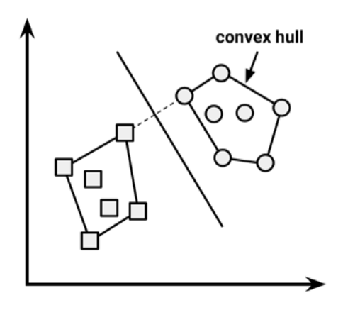

```{r setup, include=FALSE}
# knitr options
knitr::opts_chunk$set(comment = NA, prompt = TRUE, tidy.opts=list(width.cutoff=60),tidy=TRUE, 
               fig.width = 7, fig.height = 7,echo = TRUE, 
               message = FALSE, warning = FALSE, cache=T, out.extra = "")

```


# Understanding Support Vector Machines

A **Support Vector Machine (SVM)** can be imagined as a surface that creates a boundary between points of data plotted in multidimensional that represent examples and their feature values. The goal of a SVM is to create a flat boundary called a **hyperplane**, which divides the space to create fairly homogeneous
partitions on either side. In this way, the SVM learning combines aspects of both the instance-based nearest neighbor learning and the linear regression modeling, The combination is extremely powerful, allowing SVMs to model highly complex relationships.


SVMs can be adapted for use with nearly any type of learning task, including both classification and numeric prediction. Many of the algorithm's key successes have come in pattern recognition. Notable applications include:


* Classification of microarray gene expression data in the field of bioinformatics to identify cancer or other genetic diseases
* Text categorization such as identification of the language used in a document or the classification of documents by subject matter
* The detection of rare yet important events like combustion engine failure,
security breaches, or earthquakes

SVMs are most easily understood when used for binary classification, which is how the method has been traditionally applied. Therefore, in the remaining sections, we will focus only on SVM classifiers. The same principles you learn here will apply while adapting SVMs to other learning tasks such as numeric prediction.

# Classification with hyperplanes


As noted previously, SVMs use a boundary called a hyperplane to partition data into groups of similar class values. For example, the following figure depicts hyperplanes that separate groups of circles and squares in two and three dimensions. Because the circles and squares can be separated perfectly by the straight line or flat surface, they are said to be *linearly separable*. At first, we'll consider only the simple case where this is true, but SVMs can also be extended to problems where the points are *not linearly separable.*

```{r fig1,echo=FALSE,fig.align='center',fig.cap="hyperplanes",out.width="50%"}

```

In two dimensions, the task of the SVM algorithm is to identify a line that separates the two classes. As shown in the following figure, there is more than one choice of dividing line between the groups of circles and squares. Three such possibilities are labeled a, b, and c. How does the algorithm choose?

```{r fig2,echo=FALSE,fig.align='center',fig.cap="several lines classifies",out.width="50%"}

```

The answer to that question involves a search for the **Maximum Margin Hyperplane (MMH)** that creates the greatest separation between the two classes. Although any of the three lines separating the circles and squares would correctly classify all the data points, it is likely that the line that leads to the greatest separation will generalize the best to the future data. The maximum margin will improve the chance that, in spite of random noise, the points will remain on the correct side of the boundary.

The **support vectors** (indicated by arrows in the figure that follows) are the points from each class that are the closest to the MMH; each class must have at least one support vector, but it is possible to have more than one. Using the support vectors alone, it is possible to define the MMH. This is a key feature of SVMs; the support vectors provide a very compact way to store a classification model, even if the number of features is extremely large.

```{r fig3,echo=FALSE,fig.align='center',fig.cap="Support Vectors",out.width="50%"}

```

The algorithm to identify the support vectors relies on vector geometry and involves some fairly tricky math that is outside the scope. However, the basic principles of the process are fairly straightforward.

# The case of linearly separable data

It is easiest to understand how to find the maximum margin under the assumption that the classes are linearly separable. In this case, the *MMH* is as far away as possible from the outer boundaries of the two groups of data points. These outer boundaries are known as the **convex hull**. The *MMH* is then the perpendicular bisector of the shortest line between the two convex hulls. Sophisticated computer
algorithms that use a technique known as **quadratic optimization** are capable of finding the maximum margin in this way.


```{r fig4,echo=FALSE,fig.align='center',fig.cap="Convex Hull",out.width="50%"}

```


An alternative (but equivalent) approach involves a search through the space of every possible hyperplane in order to find a set of two parallel planes that divide the points into homogeneous groups yet themselves are as far apart as possible.

To understand this search process, we'll need to define exactly what we mean by a hyperplane. In n-dimensional space, the following equation is used.

$$ \vec w \cdot  \vec x+b=0$$

$w$ is a vector of $n$ weights, that is, ${w 1 , w 2 , ..., w n }$, and $b$ is a single number known as the bias. The bias is conceptually equivalent to the intercept term in the slope-intercept in Regression Methods.

Using this formula, the goal of the process is to find a set of weights that specify two
hyperplanes, as follows:

$$ \vec w \cdot  \vec x+b\geq +1 \\  \vec w \cdot  \vec x+b\leq -1 $$

We will also require that these hyperplanes are specified such that all the points of one class fall above  the first hyperplane and all the points of the other class fall beneath the second hyperplane. This is possible so long as the data are linearly separable.

Vector geometry defines the distance between these two planes as:

$$\frac{2}{||\vec w ||} $$
Here, $||w||$ indicates the Euclidean norm (the distance from the origin to vector $w$).
Because $||w||$ is in the denominator, to maximize distance, we need to minimize $||w||$. The task is typically reexpressed as a set of constraints, as follows:

$$min\frac{1}{2}||\vec w||^2 \\ s.t \ y_i(\vec w \cdot \vec x_i-b ) \geq 1,\forall\vec x_i $$

Although this looks messy, it's really not too complicated to understand conceptually. Basically, the first line implies that we need to minimize the Euclidean norm (squared and divided by two to make the calculation easier). The second line notes that this is subject to $(s.t.)$, the condition that each of the $y_i$ data points is correctly classified. Note that y indicates the class value (transformed to either $+1$ or $-1$)

As with the other method for finding the maximum margin, finding a solution to this problem is a task best left for quadratic optimization software. Although it can be processor-intensive, specialized algorithms are capable of solving these problems quickly even on fairly large datasets.

# The case of nonlinearly separable data

So far we worked through the theory behing SVMs, but what happens when the data is not linearly separable? the solution to this problem is the use of a slack variable, which creates a soft margin
that allows some points to fall on the incorrect side of the margin. The figure that follows illustrates two points falling on the wrong side of the line with the corresponding slack terms (denoted with the Greek letter Xi $\xi$)

```{r fig5,echo=FALSE,fig.align='center',fig.cap="Non linearly separable",out.width="50%"}

```
A cost value (denoted as $C$) is applied to all points that violate the constraints, and rather than finding the maximum margin, the algorithm attempts to minimize the total cost. We can therefore revise the optimization problem to:
$$min\frac{1}{2}||\vec w||^2 +C\sum_i^n\xi_i \\ s.t \ y_i(\vec w \cdot \vec x_i-b ) \geq 1-\xi_i,\forall\vec x_i,\xi_i $$
The important piece to understand is the addition of the cost parameter C. Modifying this value will adjust the penalty, for example, the fall on the wrong side of the hyperplane. The greater the cost parameter, the harder the optimization will try to achieve 100 percent separation. On the other hand, a lower cost parameter will place the emphasis on a wider overall margin. It is important to strike a balance between these two in order to create a model that generalizes well to future data.

# Using kernels for non-linear spaces

In many real-world applications, the relationships between variables are nonlinear. As we just discovered, a SVM can still be trained on such data through the addition of a slack variable, which allows some examples to be misclassified. However, this is not the only way to approach the problem of nonlinearity. A key feature of SVMs is their ability to map the problem into a higher dimension space using a process known as the **kernel trick**. In doing so, a nonlinear relationship may suddenly
appear to be quite linear.

Though this seems like nonsense, it is actually quite easy to illustrate by example. In the following figure, the scatterplot on the left depicts a nonlinear relationship between a weather class (sunny or snowy) and two features: latitude and longitude. The points at the center of the plot are members of the snowy class, while the points at the margins are all sunny. Such data could have been generated from a set of weather reports, some of which were obtained from stations near the top of a mountain, while
others were obtained from stations around the base of the mountain.

```{r fig6,echo=FALSE,fig.align='center',fig.cap="Kernel Trick",out.width="50%"}

```

On the right side of the figure, after the kernel trick has been applied, we look at the data through the lens of a new dimension: altitude. With the addition of this feature, the classes are now perfectly linearly separable. This is possible because we have obtained a new perspective on the data. In the left figure, we are viewing the mountain from a bird's eye view, while in the right one, we are viewing the
mountain from a distance at the ground level. Here, the trend is obvious: snowy weather is found at higher altitudes.


SVMs with nonlinear kernels add additional dimensions to the data in order to create separation in this way. Essentially, the kernel trick involves a process of constructing new features that express mathematical relationships between measured characteristics. For instance, the altitude feature can be expressed mathematically as an interaction between latitude and longitude—the closer the point is to the center of each of these scales, the greater the altitude. This allows SVM to learn concepts that
were not explicitly measured in the original data.

# Strengths and Weaknesses

SVMs with nonlinear kernels are extremely powerful classifiers, although they do
have some downsides, as shown in the following table:

| **Strengths**                                                                                                              | **Weaknesses**                                                                                                 |
|----------------------------------------------------------------------------------------------------------------------------|----------------------------------------------------------------------------------------------------------------|
| *  Can be used for classification or numeric prediction problems                                                           | * Finding the best model requires<br>testing of various combinations of<br>kernels and model parameters        |
| * Not overly influenced by noisy data and not very prone to overfitting                                                    | * Can be slow to train, particularly if<br>the input dataset has a large number<br>of features or examples<br> |
| *  Maybe easier to use than neural networks, particularly due to the<br>existence of several well-supported SVM algorithms | * Results in a complex black box<br>model that is difficult, if not<br>impossible, to interpret                |
| * Gaining popularity due to its high accuracy and high-profile wins in<br>data mining competitions                         |                                                                                                                |


Kernel functions, in general, are of the following form. The function denoted by the Greek letter phi, that is, $\phi (x)$, is a mapping of the data into another space. Therefore, the general kernel function applies some transformation to the feature vectors $x_i$ and $x_j$ and combines them using the **dot product**, which takes two vectors and returns a single number.

$$K(\vec x_i,\vec x_j) = \phi(\vec x_i) \cdot \phi(\vec x_j)$$

Using this form, kernel functions have been developed for many different domains of data. A few of the most commonly used kernel functions are listed as follows. Nearly all SVM software packages will include these kernels, among many others.

* The **linear kernel** does not transform the data at all. Therefore, it can be expressed simply as the dot product of the features:

$$K(\vec x_i,\vec x_j) = \vec x_i \cdot \vec x_j$$

* The **polynomial kernel** of degree *d* adds a simple nonlinear transformation of the data.

$$ K(\vec x_i,\vec x_j) = (\vec x_i \cdot \vec x_j+1)^d$$


* The **sigmoid kernel** results in a SVM model somewhat analogous to a neural network using a sigmoid activation function. The Greek letters kappa and delta  are used as kernel parameters:

$$ K(\vec x_i,\vec x_j) = tanh(\kappa\ \vec x_i \cdot \vec x_j+\delta)$$
* The **Gaussian RBF kernel** is similar to a RBF neural network. The RBF kernel performs well on many types of data and is thought to be a reasonable starting point for many learning tasks:


$$K(\vec x_i,\vec x_j) = e^{\frac{-||\vec x_i-\vec x_j||^2}{2 \sigma ^2}} $$

There is no reliable rule to match a kernel to a particular learning task. The fit depends heavily on the concept to be learned as well as the amount of training data and the relationships among the features. Often, a bit of trial and error is required by training and evaluating several SVMs on a validation dataset. This said, in many cases, the choice of kernel is arbitrary, as the performance may vary slightly. To see how this works in practice, let's apply our understanding of SVM classification to a
real-world problem.


# Workflow for detect tumor in colon samples


## Step 1: Collect data and trasnform

```{r frag1.1,echo=F}

libraries <- c("reshape2", "ggplot2", "kernlab" ,"caret")
check.libraries <- is.element(libraries, installed.packages()[, 1])==FALSE
libraries.to.install <- libraries[check.libraries]
if (length(libraries.to.install!=0)) {
  install.packages(libraries.to.install)
}

success <- sapply(libraries,require, quietly = FALSE,  character.only = TRUE)
if(length(success) != length(libraries)) {stop("A package failed to return a success in require() function.")}
```

```{r frag1, echo=FALSE,message=FALSE,warning=FALSE}
datos<-read.csv(file=file.path(params$folder.data,params$myfile),sep = ",")
```

The data is obtained from an expression analisis in patients with colon cancer by means of microarrays of olinonucleotides. After a process of filtered and normalization, there has been selected, the expression of `r ncol(datos)-1` genes and `r nrow(datos)` samples of colon tissue where 40 are tumoral adn 22 are healthy. The last variable, indicates "n" as normal and "t" as tumoral.

```{r frag2, echo=TRUE,message=FALSE,warning=FALSE,fig.align='center',fig.height=4}
clases<-as.factor(datos[,ncol(datos)])
X<-datos[,-ncol(datos)]
X.melt<-melt((log2(X)))
p <- ggplot(aes(x=value,colour=variable), data=X.melt)
p + geom_density(show.legend = F)
```
```{r frag.2b,message=FALSE,warning=FALSE}
X.log<-log2(X)
datos.log<-cbind(X,clases)
class(datos.log)
```


## Step 2: Split the data in train and test

```{r frag3,message=FALSE,warning=FALSE}
n<-nrow(datos)
```

```{r frag4,message=FALSE,warning=FALSE}
# create training and test data
set.seed(params$seed.train)

train <- sample(n,floor(n*params$p.train))
datos.train <- datos.log[train,]
datos.test  <- datos.log[-train,]
```

## Step 3 - Model Training
Usamos un kernel lineal
```{r frag5,message=FALSE,warning=FALSE}
clasifier.lineal<-ksvm(clases~ .,data=datos.train,kernel="vanilladot")
clasifier.gauss<-ksvm(clases~.,data=datos.train,kernel = "rbfdot")
```
```{r frag6}
clasifier.lineal
```
```{r frag7}
clasifier.gauss
```

## Step 4: evaluating model performance

```{r frag8}
prediction.linear<-predict(clasifier.lineal,datos.test);res.linear<-table(prediction.linear,datos.test$clases)
prediction.gauss<-predict(clasifier.gauss,datos.test);res.gauss<-table(prediction.gauss,datos.test$clases)
```


```{r}
(cmatrix1 <- confusionMatrix(res.linear,positive="t"))
```

```{r}
(cmatrix2<-confusionMatrix(res.gauss,positive = "t"))
```

## Step 5 (opcional) situations:

### 5-fold crossvalidation

```{r}
# modelo 5-crossvalidation 
model.5v.linear <- train(clases ~ ., datos.train, method='svmLinear', 
               trControl= trainControl(method='cv', number=5), 
               tuneGrid= NULL, tuneLength=10 ,trace = FALSE)

# plot(model.5v, alpha=0.6)
summary(model.5v.linear)
prediction <- predict(model.5v.linear, datos.test)                           # predict
res.linear.2<-table(prediction, datos.test$clases)                                  # compare

# predict can also return the probability for each class:
confusionMatrix(res.linear.2,positive="t")
```

```{r}
# modelo 5-crossvalidation 
model.5v.radial <- train(clases ~ ., datos.train, method='svmRadial', 
               trControl= trainControl(method='cv', number=5), 
               tuneGrid= NULL, tuneLength=10 ,trace = FALSE)

# plot(model.5v, alpha=0.6)
summary(model.5v.radial)
prediction <- predict(model.5v.radial, datos.test)                           # predict
res.radial.2<-table(prediction, datos.test$clases)                                  # compare

# predict can also return the probability for each class:
confusionMatrix(res.radial.2,positive="t")
```
### Bootstrap

```{r}
# Por defecto es Bootstrap, con 25 repeticiones para 3 posibles decay
# y 3 posibles sizes
model.bootstrap.linear <- train(clases ~ ., datos.train, method='svmLinear', trace = FALSE) # train
# we also add parameter 'preProc = c("center", "scale"))' at train() for centering and scaling the data

summary(model.bootstrap.linear)
prediction <- predict(model.bootstrap.linear, datos.test)                           # predict
res.gauss.2<-table(prediction, datos.test$clases)                                  # compare

# predict can also return the probability for each class:
# prediction <- predict(model.bootstrap.linear, datos.test, type="prob")  
# head(prediction)
confusionMatrix(res.gauss.2,positive="t")
```

